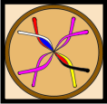

#  Langsome

We present *Langsome*, the Interlingual Medicine Translator. It has been developed for the Google Solution Challenge 2020.

*Langsome* achieves a task at which a language translator fails: Medicine Translation.


## Installation

```bash
1) git clone https://github.com/stoianmihail/Langsome.git
2) cd Langsome
3) python setup.py
```

## Usage

The application comes with an UI implemented with Tkinter in Python.
```python
python3 gui.py
```

## Status
By now, *Langsome* performs medicine translation for the following target languages:
* English
* German

We are on the way to add:
* Romanian
* French

## Workflow
[Drugbank](https://www.drugbank.ca/) has been a great source of data because of its list of synonyms for each medicine. Even so, the corresponding language for a synonym is not always specified.
Thus, we used [Gelbe Liste](https://www.gelbe-liste.de/produkte/) to find out which synonym is the German one. The *matching* then comes down to a simple multi-word expression similarity problem. That means, in order to support a new target language, we only need the list of medicines written in that respective language.

In which concerns the quality of the matching drugs, we have been very restrictive. Thus, we matched 1053 drugs out of the 13475 provided by Drugbank to their corresponding German medicines.

The multi-word expression similarity has been solved with the metric [Burkhard-Keller Tree](https://en.wikipedia.org/wiki/BK-tree). When searching for a single part of the multi-word expression, only those words are selected, which have the [Levenshtein Distance](https://en.wikipedia.org/wiki/Levenshtein_distance) with the sought part at most 1. Each of the found words in tree points, in turn, to a list of medicines, out of which they originate from. By aggregating the number of occurrences of each medicine, we get the ranking of the selected medicines.

We then filter out the non-qualifying ones by introducing a lower bound on the number of occurrences, based on the number of parts in the multi-word expression, coupled with an analysis based on the [Softmax function](https://en.wikipedia.org/wiki/Softmax_function) applied on the lengths of the parts found in the metric tree.

